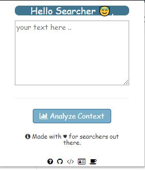
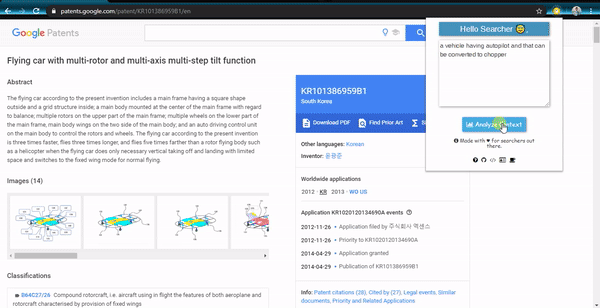

# CONTEXT ANALYZER     
##### A NLP based Chrome extension build with JavaScript and Python-Flask.
----------------------------


## Installation :wrench:
1. Download the repository by clicking clone or Download button.
2. In your Chrome browser:```More Tools > Extensions > Load Unpacked > Select the Downloaded Folder.```
3. Viola!! you are good to go.

## Setting Up :electric_plug:
As of Now it uses Flask API based backend (can be a centralised single server as well). To set it up on your environment:
1. ```pip install -r requirements.txt```.
2. Open  ```python``` shell :
```
  import nltk
  nltk.download('stopwords')
  ```
3. Change Path to directory and run ```python main.py```. You'll Now see your Flask API running.
4. If you are not running it on localhost set your ip in ```settings``` variable in ```background.js``` file.


## How to USE :mag:
After Setting you can use it like:



In Google Word2Vec model these kind of possiblities are covered.


## Contributions :computer:
1. [Vishal](https://github.com/the-vishal)
2. [Vikas Gupta](https://github.com/Vikas92155) 

--------
Contributions are Welcome :blush:.
